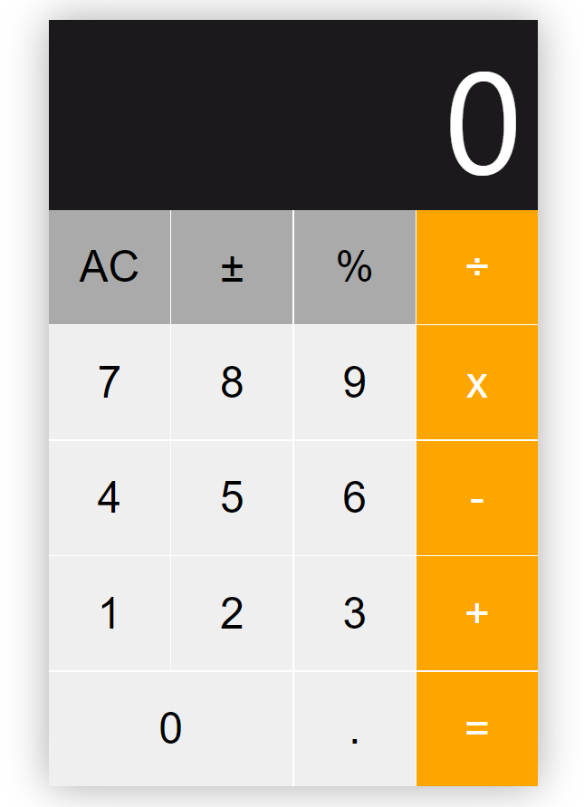

This project was bootstrapped with [Create React App](https://github.com/facebook/create-react-app).

# React Calculator

Simple calculator build with [React.js](https://github.com/facebook/react) using [React Hooks](https://reactjs.org/docs/hooks-intro.html), and inspired by the MacOS Calculator.

### Preview

### Running locally

1. Clone this repo
2. Type cd ac-react-calculator to enter the project folder
3. Run npm install and install dependencies
4. Run npm start and visit localhost:3000

### Build

1. Run npm run build
2. The compiled version will be in /build/

## Author

- Carlos Matos

## Checklist

- [ ] Add keyboard support
- [ ] Fix bug when adding a dot
- [ ] Show error message when dividing by 0